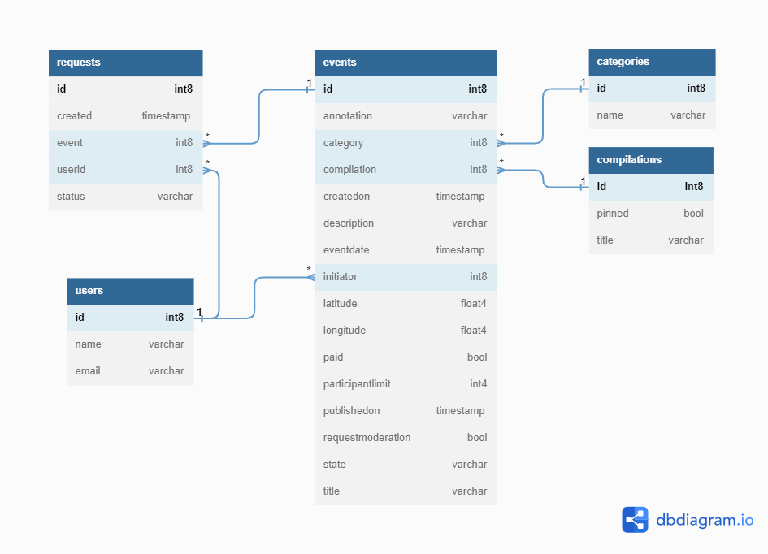
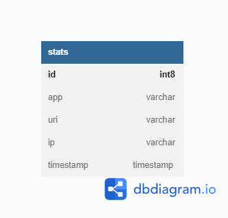

# Дипломный проект Марии Копыловой  
## ExploreWithMe.  
[Репозиторий](https://github.com/Mariya040122/java-explore-with-me/pull/2)  
## Описание проекта
Данное приложение было разработано в рамках дипломного проекта.
Оно дает возможность делиться информацией об интересных событиях и помогать найти компанию для участия в них.  
Приложение написано на Java, с использованием фреймворка Spring Boot и библиотек Hibernate и Lombok. Хранилищем данных 
является база данных PostgreSQL. Для сборки проекта используется фреймворк Maven.  

Приложение состоит из 2-х сервисов:  
* Основной сервис Main — содержит возможности для просмотра и добавления мероприятий;
подачи, подтверждения или отклонения заявок на участие в мероприятиях; 
инструменты для администрирования сервиса. [Спецификация API](https://raw.githubusercontent.com/yandex-praktikum/java-explore-with-me/main/ewm-main-service-spec.json)  
* Сервис статистики Stat — обеспечивает возможность хранения и получения статистики просмотров,
позволяет делать различные выборки для анализа работы приложения. [Спецификация API](https://raw.githubusercontent.com/yandex-praktikum/java-explore-with-me/main/ewm-stats-service-spec.json)  

Для запуска приложения используйте команду mvn clean package для сборки проекта и команду docker-compose up --build для запуска.
  
Схема базы данных основного сервиса.  
  
  
Схема базы данных сервиса статистики.  

